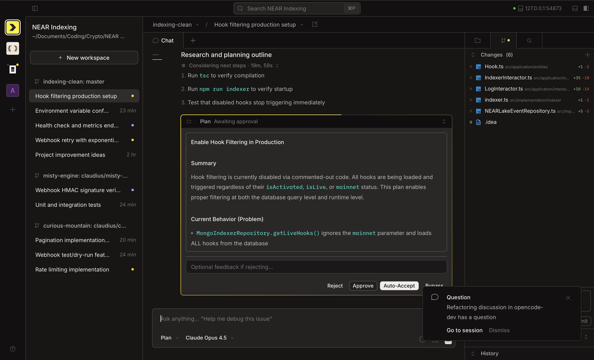

  <picture>
    <source srcset="packages/web/src/assets/logo-wreath-light.svg" media="(prefers-color-scheme: dark)">
    <source srcset="packages/web/src/assets/logo-wreath-dark.svg" media="(prefers-color-scheme: light)">
    
  </picture>

<h1 align="center">Claudius</h1>

A desktop app for Claude Code, built on OpenCode.

---

---

## Download

| Platform              | Download                                                                                                   |
| --------------------- | ---------------------------------------------------------------------------------------------------------- |
| macOS (Apple Silicon) | [Download](https://github.com/crisogray/claudius/releases/latest/download/Claudius-latest-macos-arm64.dmg) |
| macOS (Intel)         | [Download](https://github.com/crisogray/claudius/releases/latest/download/Claudius-latest-macos-x64.dmg)   |
| Windows               | [Download](https://github.com/crisogray/claudius/releases/latest/download/Claudius-latest-windows-x64.exe) |

---

## About

Claudius is a fork of [OpenCode](https://github.com/anomalyco/opencode) Desktop rebuilt around the Claude Agent SDK.

### Key Features

- **Works out of the box** - No configuration required if already using Claude Code. Just download and start coding.
- **Deep Claude integration** - Built on the Claude Agent SDK for native prompt caching, extended thinking, and sandboxed execution.
- **Planning mode** - Switch between full-access build mode and read-only planning mode.
- **Permission modes** - Granular control over what the agent can do.
- **Native tools** - Read, Edit, Write, Bash, Glob, Grep, and more - all handled natively.

---

## Contributing

Interested in contributing? See [CONTRIBUTING.md](./CONTRIBUTING.md) for guidelines.

For technical context on the architecture:

- [UPSTREAM.md](./UPSTREAM.md) - OpenCode upstream documentation

---

  Built with the <a href="https://docs.anthropic.com/en/docs/claude-agent-sdk">Claude Agent SDK</a>

